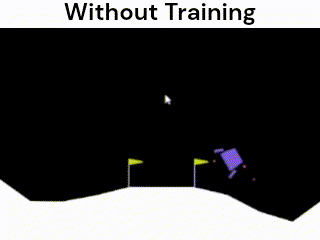
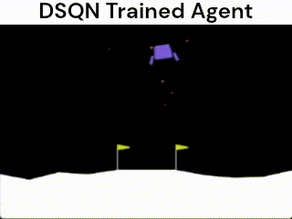

# RL-CW2

Coursework 2 project for the MSc Data Science program at the University of Bath. This folder focuses on the implementation and evaluation of environments with a large number of states where tabular methods are not feasible alternatives. Hence, we A comparison between SARSA, Q-Learning (DQN) and Temporal Differences algorithms has been done. The Lunar Lander version 3 has been chosen due to its complexity without requiring a great computational power in terms of GPU to train agents.

## What methods can you find in this repo?

Since the exploration of these algorithms include different variants, the follow table show briefly what you cand find in this repository.

| **Algorithm**         | **Sub types**                                | **Key features**                                                                 |
|-----------------------|----------------------------------------------|----------------------------------------------------------------------------------|
| **SARSA**             | Semi-Gradient SARSA                          | SARSA update rule, linear approximation, one network (Policy)                   |
|                       | Deep SARSA Network                           | Experience replay                                                               |
|                       | Deep SARSA Q-Network                         | Experience replay                                                                |
| **Q-Learning**        | Deep Q-Network                               | Q-Learning update rule, two networks (Policy and Target), target network freezing. |
|                       | Double Deep Q-Network                        | Experience replay                                                               |
| **Temporal Difference** | Gradient TD(0) Linear approximation         | TD update rule, one network (Policy)                                            |
|                       | Gradient TD(0) Neural Network                | Experience replay                                                               |

## 📽️ Game Demo

| Demo without training | Demo after training |
|--------|--------|
|  | 

## Folder Structure

- **`TD(0)/`**: Contains implementations of various TD(0) algorithm variants.
  - `semi_gradient_td0.ipynb`: Notebook for the environment implementation using TD(0) semigradient.

- **`SARSA/`**: Contains implementations of various SARSA algorithm.
  - `default_env.ipynb`: Notebook for the environment implementation using SARSA algorithm variants for the default environment.
  - - `modified_env.ipynb`: Notebook for the environment implementation using SARSA algorithm variants for the modified environment.

- **`PPO/`**: Contains implementations of various PPO algorithm variants.
  - `ppo.ipynb`: Notebook for the environment implementation using PPO algorithm variants.

- **`DQN_allvariants/`**: Contains implementations of various DQN algorithm variants.
  - `base_environment.ipynb`: Notebook for the base environment implementation.
  - `mod_environment.ipynb`: Notebook for the modified environment implementation.

- **`Results/`**: Stores the results of experiments, including:
  - Pretrained agent parameters and rewards.
  - `results_plotting.ipynb`: Use this notebook for visualizing and analyzing experimental results from files saved on `agents_results/` and `agents_resultsmod/` folders.

## How to Use

1. Navigate to the `TD(0)/` folder to explore and run the implementations of TD(0).
2. Navigate to the `SARSA/` folder to explore and run the implementations of SARSA.
3. Navigate to the `PPO/` folder to explore and run the implementations of PPO (Proof of Concept).
4. Navigate to the `DQN_allvariants/` folder to explore and run the implementations of DQN variants.
5. Use the notebooks in the `Results/` folder to analyze and visualize the outcomes of the experiments.

## Requirements

Ensure you have the necessary dependencies installed. Refer to the `pyproject.toml` file in the `/` parent folder for a list of required packages.

You also will need:

- [Python 3.8+](https://www.python.org/)
- [uv](https://github.com/astral-sh/uv)

## 📦 Installation

Clone this repository:

```bash
git clone https://github.com/RL-UoB/RL-CW2.git
cd RL-CW2
```

Install dependencies with:

```bash
uv pip install -r pyproject.toml
```

Then, only open the notebook file you want to explore :)
